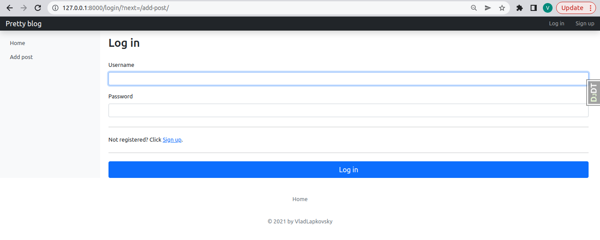

[![LinkedIn][linkedin-shield]][linkedin-url]

# Djangoblog

Used tools:
<ul>
    <li>Django</li>
    <li>Django REST Framework</li>
    <li>PostgreSQL</li>
    <li>Django debug toolbar</li>
    <li>HTML</li>
    <li>CSS</li>
    <li>pydantic</li>
    <li>Telegram Bot API</li>
    <li>Jinja2</li>
    <li>DRF-yasg</li>
</ul>

### Contact

Vlad Lapkovsky - vladlapkovsky@gmail.com

(<a href="#top">back to top</a>)

[license-shield]: https://img.shields.io/github/license/othneildrew/Best-README-Template.svg?style=for-the-badge

[license-url]: https://github.com/VladLapkovsky/Homework/blob/master/VladLapkovsky/final_task/rss_news_reader/LICENSE.txt

[linkedin-shield]: https://img.shields.io/badge/-LinkedIn-black.svg?style=for-the-badge&logo=linkedin&colorB=555

[linkedin-url]: https://www.linkedin.com/in/vladislavlapkovsky/

